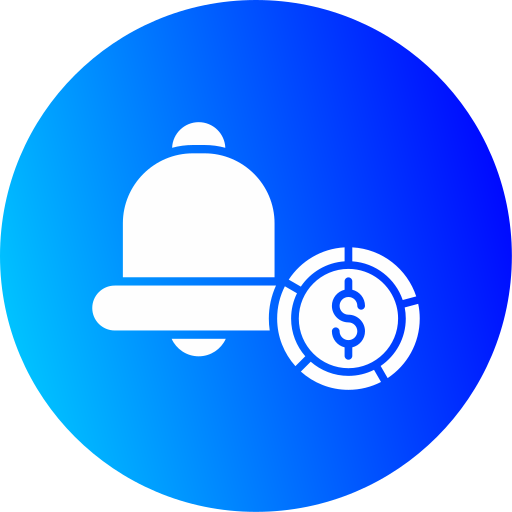

# Subsman



Subsman is a personal subscription tracker that helps you keep track of your subscriptions and save money.

## Demo Login

Use the following test account to try the app:

- Username: demo
- Password: 12345678

## Features

- Subscription Management: Track recurring subscriptions and upcoming payments so you never miss a due date.
- Category Management: Group expenses into custom categories to better understand spending patterns.
- Multi-Currency Support: Manage subscriptions in different currencies based on your preferences.
- Currency Conversion: Integrates with the Fixer API to convert values and view totals in your main currency.
- Data Privacy: Self-hosted by design, so your financial data stays on your own server.
- Customization: Personalize categories, currencies, themes, and display options to match your workflow.
- Sorting Options: View subscriptions with multiple sorting modes for faster analysis.
- Logo Search: Find subscription logos from the web when you do not have one ready to upload.
- Mobile View: Use Subsman comfortably while on the go.
- Statistics: Explore spending trends and totals from a different analytical perspective.
- Notifications: Receive reminders through email, Discord, Pushover, Telegram, Gotify, and webhooks.
- Multi-Language Support: Use the app in your preferred language.
- OIDC and OAuth: Enable modern authentication flows with OIDC/OAuth providers.
- AI Recommendations: Get smart recommendations powered by ChatGPT, Gemini, or local Ollama.

## Tech Stack

- PHP
- JavaScript
- CSS
- SQLite (via project database setup)
- Progressive Web App support (manifest + service worker)

## System Requirements

- NGINX or Apache web server
- PHP 8.3
- PHP modules enabled:
	- curl
	- dom
	- gd
	- imagick
	- intl
	- openssl
	- sqlite3
	- zip
	- mbstring
	- fpm

## Run Locally

1. Make sure PHP is installed.
2. Start a local server from the project root:

```bash
php -S 127.0.0.1:5500
```

3. Open your browser at:

```text
http://127.0.0.1:5500
```

### Run with XAMPP

You can also run Subsman with XAMPP:

1. Copy the project folder into your XAMPP `htdocs` directory.
2. Start Apache (and MySQL if you need it for other tools) from the XAMPP Control Panel.
3. Open in your browser:

```text
http://localhost/subsman
```

## New Database Migration

If you create a fresh database file, run migrations through the built-in endpoint:

```text
/endpoints/db/migrate.php
```

Example using local development server:

```text
http://127.0.0.1:5500/endpoints/db/migrate.php
```

Run this once to initialize or migrate the database schema.

## Project Structure

- `api/` and `endpoints/`: backend API routes and actions
- `includes/`: shared PHP helpers and app bootstrap files
- `scripts/`: frontend JavaScript modules
- `styles/`: app styles and themes
- `images/`: app icons, screenshots, avatars, and uploads

## License

Personal project.

## Contact

For any issue report, amendment, feature request, or if you want help customizing Subsman for yourself, please email:

If you need any type of service related to ERP, CMS, AI solutions, SaaS tools, or any other tech service, you can also contact:

hafizmoazkhalid@gmail.com
